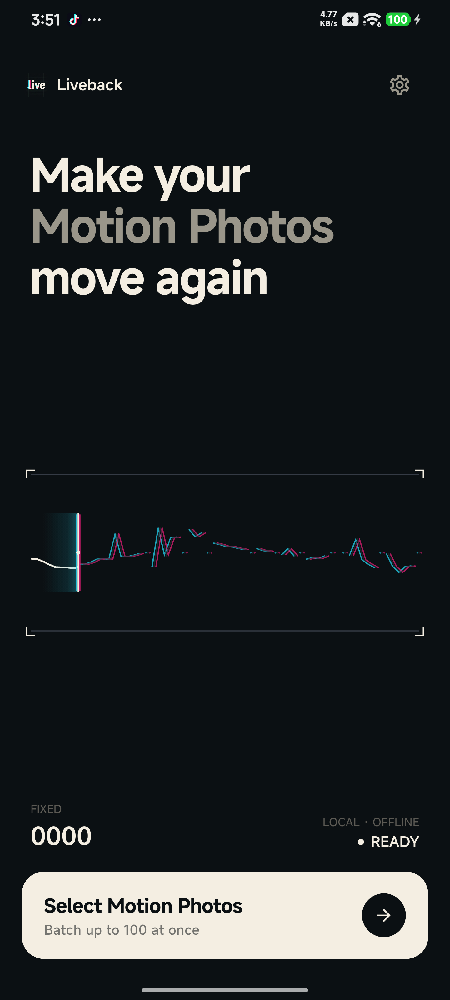
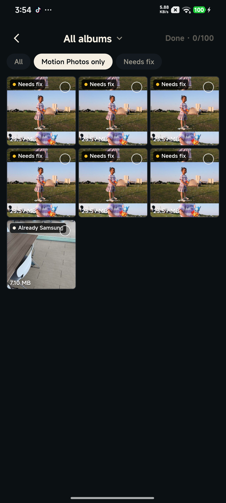
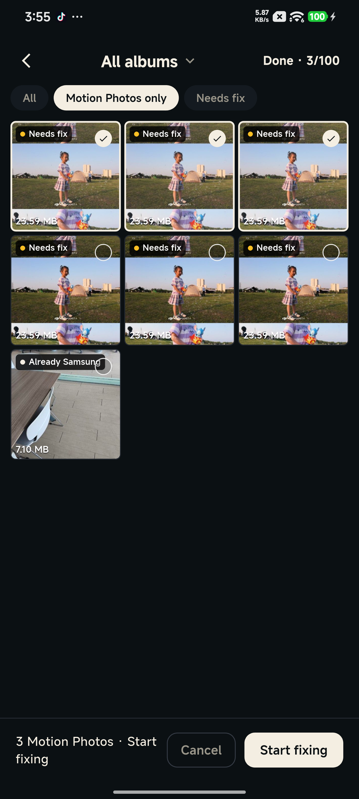
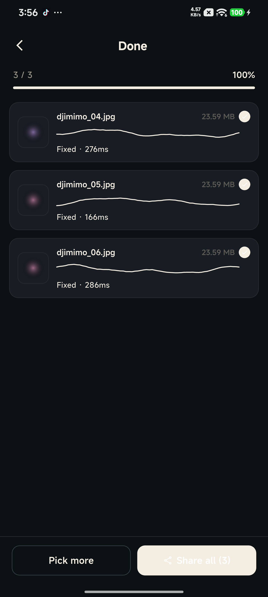
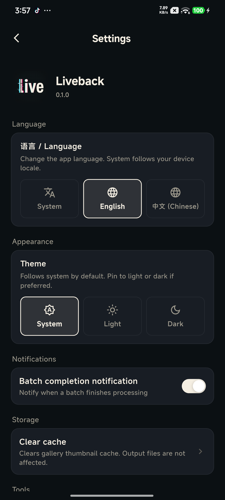

<div align="center">


# Liveback

**Repair Samsung Motion Photo metadata so WeChat accepts djimimo exports.**

*Local · Offline · Android only*

[](https://github.com/ZKXSparke/Liveback/releases/latest)
[-green)](https://github.com/ZKXSparke/Liveback/releases/latest)
[](LICENSE)

[Download APK](https://github.com/ZKXSparke/Liveback/releases/latest) · [中文](#中文)

</div>

---

## What it does

On newer Samsung phones, *Motion Photos* are JPEGs with an MP4 video trailer and a proprietary **SEF** (Samsung Extended Format) marker. WeChat's Android client only recognizes photos carrying that SEF marker as Live Photos — native-shot Samsung motion photos send just fine.

Third-party tools like **djimimo** generate the JPEG + MP4 combo but **omit the SEF trailer**, so WeChat treats them as regular still photos.

Liveback rewrites those djimimo exports to look byte-identical to native Samsung motion photos:

- Stamps EXIF `Make = samsung` and `Model = Galaxy S23 Ultra`
- Inserts the inline `MotionPhoto_Data` marker after the JPEG EOI
- Appends an `SEFH`/`SEFT` trailer with a single `MotionPhoto_Data` record pointing at the marker

No cloud, no accounts, no network. Everything happens on your phone, offline.

## Screenshots

<p align="center">
  
  
  
</p>
<p align="center">
  
  
  
</p>

## Install

Grab the signed APK from the [latest release](https://github.com/ZKXSparke/Liveback/releases/latest):

1. Download `Liveback-<version>.apk`
2. On your phone, tap the APK in your Downloads folder
3. Allow "Install unknown apps" for your browser/file manager when prompted
4. Open Liveback, grant the "Photos and videos" permission on first launch

Requirements: Android 10 (API 29) or newer.

## How to use

1. Tap **Select Motion Photos** on the home screen
2. The gallery shows your photos with badges:
   - Orange dot **Needs fix** — a djimimo Motion Photo; WeChat won't play it
   - Subtle check **Already Samsung** — a native Motion Photo; WeChat already plays it
   - No badge — a regular still photo
3. Default filter is **Motion Photos only** — toggle to **All** or **Needs fix** as you like
4. Tap to preview — auto-plays the embedded video once, hold for looped replay
5. Select the ones you want to repair, tap **Start fixing**
6. When the batch finishes, tap **Share to WeChat** to send directly

Repaired files land in `Pictures/Liveback/` with the original `DateTimeOriginal` EXIF timestamp preserved.

## Features

- Motion Photo detection via cheap tail + head byte scan (~10 ms per file)
- Album / bucket picker with filter chips
- Three-finger drag-select or checkbox multi-select (up to 100 per batch)
- Tap-to-preview with auto-play + round play button + hold-to-loop
- English + 中文 locale (follows system, user-switchable in Settings)
- Light / dark theme (follows system, user-switchable in Settings)
- Samsung-native idempotency — re-fixing a file is a no-op
- Glitch-to-clean splash animation in brand voice

## Build from source

```bash
# Prerequisites: Flutter 3.24+, Android SDK 34+, JDK 17
git clone https://github.com/ZKXSparke/Liveback.git
cd Liveback
flutter pub get
flutter build apk --debug       # unsigned debug APK, any device
```

For a signed release build you need your own keystore in `android/key.properties` (the file is gitignored). Minimum shape:

```properties
storeFile=/absolute/path/to/your-release.jks
storePassword=...
keyAlias=...
keyPassword=...
```

Then `flutter build apk --release` produces a signed APK at `build/app/outputs/flutter-apk/app-release.apk`.

Architecture docs live under `architecture/` (Flutter overview / binary format library / Android platform layer). Byte-format research under `analysis/`.

## License

MIT. See [LICENSE](LICENSE).

---

<a id="中文"></a>

<div align="center">

# Liveback · 中文

**让 djimimo 导出的实况图被微信识别为三星原生实况图。**

*本地 · 离线 · 仅 Android*

[下载 APK](https://github.com/ZKXSparke/Liveback/releases/latest)

</div>

## 做什么的

新款三星手机的「实况图」本质是一张 JPEG 加一段 MP4 视频尾巴，再加上三星私有的 **SEF**（Samsung Extended Format）标记。微信 Android 端只认带 SEF 标记的照片为实况图——三星原生拍摄的实况图发微信能直接播放。

**djimimo** 这类第三方工具生成的实况图有 JPEG + MP4，但**没有 SEF 尾**，所以微信把它们当普通静态图处理。

Liveback 把 djimimo 导出的文件改造成跟三星原生实况图字节级一致：

- 修改 EXIF 的 `Make = samsung`、`Model = Galaxy S23 Ultra`
- 在 JPEG EOI 之后插入 `MotionPhoto_Data` 内联标记
- 在文件末尾追加 `SEFH`/`SEFT` 目录，指向那个标记

全程本地处理，不联网，不登录。

## 安装

去 [Releases 页](https://github.com/ZKXSparke/Liveback/releases/latest) 下 APK：

1. 下载 `Liveback-<版本>.apk`
2. 手机上点开 APK
3. 允许浏览器/文件管理器「安装未知来源应用」
4. 首次打开授予「照片和视频」权限

需要 Android 10（API 29）或更高。

## 使用

1. 主屏点「选择实况图」
2. 图库里每张图有角标：
   - 橙点「待修复」——djimimo 实况图，微信识别不了
   - 浅勾「已是三星」——原生实况图，微信能直接播
   - 无角标——普通静态图
3. 默认筛选「仅实况图」，可切「全部」或「待修复」
4. 点缩略图进预览——自动播一遍视频，长按循环
5. 选好后点「开始修复」
6. 批次完成点「分享到微信」直接发送

修复后的文件存在 `Pictures/Liveback/`，保留原始 `DateTimeOriginal` EXIF 时间戳。

## 开发者

架构文档：`architecture/01-flutter-overview.md`、`02-binary-format-lib.md`、`03-android-platform.md`。

字节格式研究：`analysis/02-binary-format.md`。

## 协议

MIT 协议。详见 [LICENSE](LICENSE)。
